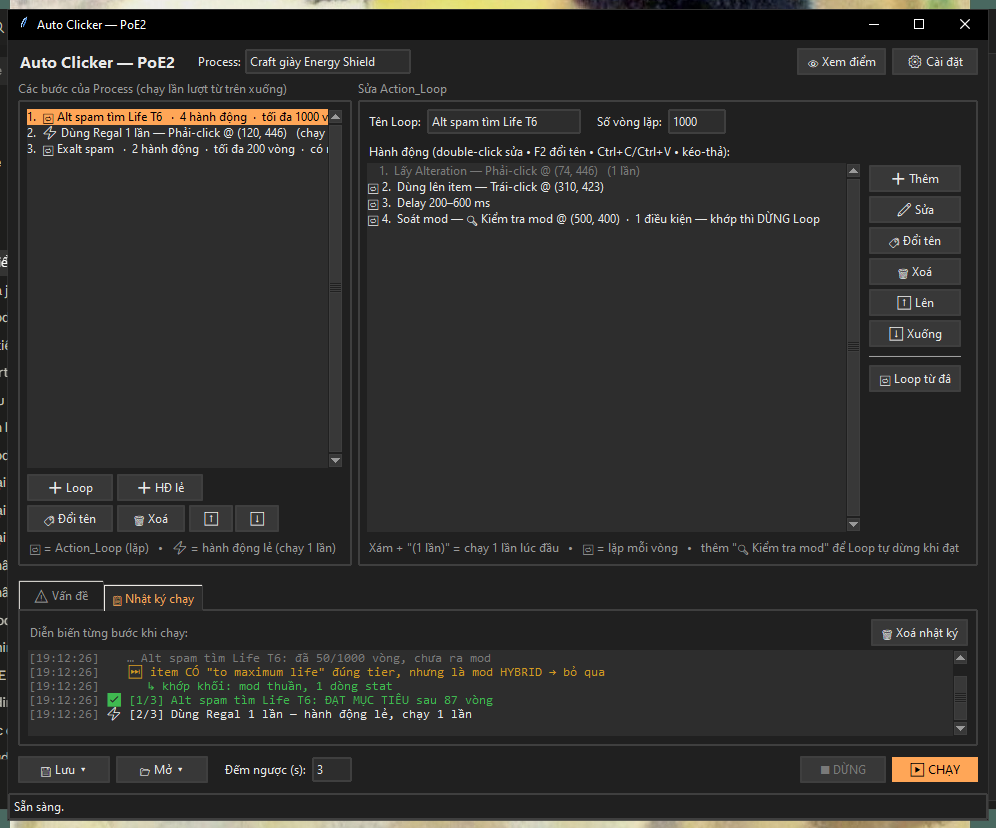

# Auto Clicker cho Path of Exile

Tự động dùng currency lên item **cho tới khi ra đúng mod bạn muốn**, rồi tự dừng.

App đọc mod của item bằng cách rê chuột vào item và bấm `Ctrl+C` — game copy toàn bộ chữ item ra clipboard — rồi so khớp **đúng tên mod + đúng Tier**. Không dùng nhận diện ảnh, không đoán mò.



---

## Tải về

> ### [⬇ Tải bản mới nhất (.zip)](../../releases/latest)

Giải nén ra rồi bấm đúp `AutoClicker.exe`. **Giữ nguyên cả thư mục** — các file bên cạnh là thư viện cần để chạy.

**Không cần cài Python**, không cần cài gì thêm.

Lần đầu chạy Windows sẽ cảnh báo — [xem cách xử lý bên dưới](#windows-báo-chặn-thì-làm-sao).

---

## Làm được gì

- **Chuỗi nhiều bước.** Một *Process* gồm nhiều *Action_Loop* nối tiếp, xen được các hành động chạy 1 lần ở giữa. Ví dụ: spam Alteration → dùng Regal 1 lần → spam Exalt.
- **Dừng đúng lúc.** Thêm hành động *Kiểm tra mod*; khớp là dừng ngay, **không táp thêm một orb nào nữa**.
- **Chọn mod từ danh sách chính thức.** Lấy từ Trade API của game (~3.200 mod PoE2 / ~8.600 PoE1), gõ để tìm rồi chọn — không phải gõ tay nên không sai chính tả.
- **Lọc mod thuần / mod hybrid.** Một affix cho nhiều dòng stat (vd Armour + Energy Shield) có bậc Tier riêng, khác hẳn mod thuần cùng tên. Chọn được: cả hai / chỉ mod thuần / chỉ mod hybrid.
- **Tự dừng khi có sự cố.** Không đọc được chữ item 3 lần liên tiếp (game mất focus, chuột lệch vị trí…) là dừng ngay kèm lý do — thay vì âm thầm đốt sạch currency.
- **Soát lỗi trước khi chạy.** Panel *Vấn đề* chỉ ra chỗ sai (chưa chọn điểm, chưa có điều kiện, toạ độ nằm ngoài màn hình…) và bấm vào là nhảy tới đúng chỗ.
- **Nhật ký chạy.** Xem diễn biến từng bước, từng vòng, kèm lý do khi bỏ qua.
- **Lưu lại dùng lần sau.** Lưu cả Process, hoặc lưu riêng một Action_Loop để chèn vào Process khác.
- Các hành động: trái/phải-click, double-click, di chuyển, cuộn, nhấn phím, **giữ phím + click** (Shift/Ctrl-click), delay ngẫu nhiên, kiểm tra mod.
- **Dừng khẩn cấp bất cứ lúc nào:** phím `F6`, hoặc hất chuột vào **góc trên-trái** màn hình.

---

## Bắt đầu trong 3 bước

### 1. Bật mô tả mod chi tiết trong game — **bắt buộc**

App cần game in ra Tier của mod. Rê chuột vào một item rồi bấm `Ctrl+C`, dán ra Notepad. Phải thấy dạng này:

```
{ Prefix Modifier "Stalwart" (Tier: 6) — Life }
+44(40-59) to maximum Life
```

**Nếu không thấy dòng `{ ... (Tier: N) ... }`**, hãy bật tuỳ chọn hiển thị mô tả mod chi tiết (*Advanced Mod Descriptions*) trong phần Options ▸ UI của game. Thiếu nó thì app đọc được chữ item nhưng **không bao giờ khớp mod**.

### 2. Dựng Process

1. Bấm **➕ Loop** để tạo một Action_Loop.
2. Bấm **➕ Thêm** để thêm hành động (phải-click currency, trái-click item, delay…). Với hành động cần toạ độ, bấm **🎯 Chọn điểm** rồi ngắm crosshair vào đúng vị trí.
3. Thêm một hành động **🔍 Kiểm tra mod**: chọn điểm rê chuột vào item, tìm mod trong danh sách, nhập Tier, bấm **➕ Thêm điều kiện**.
4. Chọn dòng muốn lặp lại rồi bấm **🔁 Loop từ đây** — các dòng phía trên chỉ chạy 1 lần lúc đầu.

### 3. Chạy

Bấm **▶ CHẠY**, chuyển sang cửa sổ game trong lúc đếm ngược. Muốn dừng thì bấm `F6`.

> **Mẹo:** bấm **👁 Xem điểm** để soi lại tất cả toạ độ đã chọn ngay trên màn hình — kiểm tra crosshair có đúng chỗ không trước khi chạy thật.

---

## Windows báo chặn thì làm sao

### "Windows protected your PC"

File chưa mua chứng chỉ ký số nên SmartScreen cảnh báo. Bấm **More info** → **Run anyway**.

### Defender xoá mất file khi vừa tải xong

Đây là lý do bản phát hành là **file `.zip`** chứ không phải một file `.exe` duy nhất.

Bản gộp-1-file bị Windows Defender báo là `Trojan:Win32/Wacatac.H!ml` và **xoá ngay khi tải**. Đuôi `!ml` nghĩa là phát hiện bằng **suy đoán/máy học, không phải khớp chữ ký virus thật** — lỗi báo nhầm rất phổ biến với file đóng gói bằng PyInstaller, do kiểu 1-file phải tự giải nén ra thư mục tạm khi chạy nên bị coi là hành vi đáng ngờ.

**Bản `.zip` không có hành vi đó nên Defender không chặn** (đã quét kiểm chứng bằng chính Defender). Nếu bạn lỡ tải bản `.exe` và bị xoá, hãy tải bản `.zip` thay thế.

App **không** gửi dữ liệu đi đâu. Toàn bộ mã nguồn nằm ngay trong repo này — bạn có thể tự đọc, và [tự build lại](#tự-build-từ-mã-nguồn) nếu không muốn tin file có sẵn.

---

## Tự build từ mã nguồn

Cần Python 3.10+ trên Windows.

```bash
git clone https://github.com/VinhDac/Auto_Clicker.git
cd Auto_Clicker
tools\setup.bat          # cài thư viện
python auto_clicker_gui.py
```

Đóng gói thành `.exe`:

```bash
tools\build.bat          # kết quả ở dist\AutoClicker.exe
```

Cập nhật danh sách mod từ Trade API:

```bash
python update_mods.py            # cả PoE1 + PoE2
python update_mods.py poe2       # chỉ PoE2
```

---

## Cấu trúc dự án

```
auto_clicker_gui.py    giao diện (tkinter)
core.py                lõi — không phụ thuộc giao diện, chạy headless được
update_mods.py         tải danh sách mod từ Trade API chính thức
data/                  mods_poe1.txt, mods_poe2.txt
tools/                 build.bat, setup.bat
docs/                  tài liệu ý tưởng ban đầu
```

`core.py` chứa toàn bộ logic (đọc/so khớp mod, mô hình Process, bộ máy chạy) và **không import tkinter** — nên test được mà không cần mở cửa sổ, và đổi giao diện sau này không phải viết lại lõi.

Dữ liệu của bạn (`settings.json`, thư mục `templates/`) sinh ra cạnh file exe khi chạy, không nằm trong repo.

---

## Lưu ý

- Chỉ chạy trên **Windows** (dùng API riêng của Windows cho phím tắt toàn cục và thanh tiêu đề tối).
- Nếu cửa sổ game chạy **quyền Administrator**, hãy chạy app bằng quyền Administrator, nếu không click sẽ không ăn.
- Toạ độ được lưu theo pixel tuyệt đối. Đổi độ phân giải hoặc đổi màn hình thì phải chọn lại điểm — app sẽ cảnh báo trong panel *Vấn đề* nếu phát hiện toạ độ nằm ngoài màn hình hiện tại.
- Bạn tự chịu trách nhiệm khi dùng công cụ tự động trong game.
